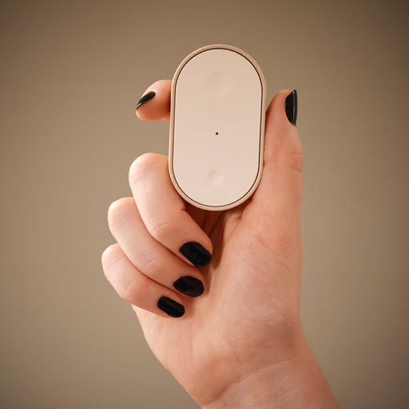

<p align="center">
  
</p>

# IKEA BILRESA Firmware Updater (HACS)

A Home Assistant custom integration that updates **IKEA BILRESA** Matter-over-Thread
remotes (dual-button and scroll-wheel variants) and reliably finishes the firmware
transfer **without making you hold down a button on the remote**.

It works for any firmware version your device reports an update for (for example
`1.8.5 -> 1.9.15`), because it resolves the latest applicable image from the CSA
Distributed Compliance Ledger (DCL) rather than hard-coding versions.

## What this does for you

In plain terms: **BILRESA firmware updates from Home Assistant usually stall or
fail because the remote falls asleep mid-transfer.** The known workaround is to
stand there pressing buttons on the remote for the entire update. This
integration does that for you, digitally — it notices an update starting (from
HA, Apple Home, Google Home, anywhere) and keeps the remote awake until the
update finishes. No button mashing, no babysitting.

Install it once and forget it; it sits idle until a firmware update begins.

<p align="center">
  
</p>

## Confirmed working

Verified on real BILRESA hardware (see [Testing & findings](#testing--findings)
for details):

- [x] Complete end-to-end firmware update (`1.8.5 -> 1.9.15`) via the native
      HA Update entity, hands-free
- [x] Device honors `StayActiveRequest` with a 30-second active-mode promise
      per send
- [x] Updates are detected the moment they start, from any controller, and
      keep-awake stops as soon as the device returns to idle
- [x] Updates already in progress are picked up after an HA restart
- [x] Keep-awake survives transient radio dropouts and continues retrying
      through a transfer
- [x] **Keep awake now** button wakes the device on demand

Because the firmware image is resolved from the CSA DCL at update time, this
works for **any** BILRESA firmware version — past and future — not just the
versions it was tested on. The keep-awake mechanism is feature-detected from
the device (ICD `AcceptedCommandList`), so future firmware that keeps standard
ICD behaviour will keep working.

## Why this exists

The BILRESA is a battery-powered Matter **Intermittently Connected Device (ICD) /
Sleepy End Device**. To save power it polls its Thread router slowly. During a
firmware update it must be in **active mode** (fast polling) so the
Block Data Exchange (BDX) transfer can run.

Home Assistant's built-in Matter updater simply announces the OTA Provider and
waits. On a sleepy ICD the device drops back to slow polling and the underlying
`python-matter-server` aborts the update on the `querying -> idle` transition.
The common workaround is to repeatedly press the remote, which fires the Matter
**User Active Mode Trigger** and forces active mode.

This integration automates that. While the update runs it issues the Matter
**`StayActiveRequest`** command (ICD Management cluster `0x0046`) on a timer,
re-arming before each `PromisedActiveDuration` expires — the button-free
equivalent of holding the remote awake.

## How it works

This integration does **not** add its own update button. Home Assistant's
built-in Matter integration already provides a working firmware **Update** entity
for the BILRESA (it talks to the CSA DCL and runs the OTA Provider). The only
thing it lacks is keeping the sleepy device awake.

So this integration runs purely in the background: it connects to your Matter
Server as a *second* websocket client, watches each BILRESA's OTA `UpdateState`,
and the moment an update starts (from the native button, Apple Home, Google,
etc.) it fires the `StayActiveRequest` keep-awake loop until the transfer
finishes.

```
You press the native "Firmware" Update button (or any controller starts an OTA)
        │
        ▼
Matter Server (python-matter-server) runs the OTA Provider + BDX transfer
        │  OTA UpdateState -> querying/downloading/applying
        ▼
this integration (watching UpdateState) ──► StayActiveRequest loop ──► BILRESA
                                            (re-armed until state returns to idle)
```

## Requirements

- Home Assistant 2024.12 or newer.
- The official **Matter (BETA)** integration set up and working, with a Thread
  border router (HA Connect ZBT-1, a Thread radio, or a Dirigera hub acting as a
  border router) and IPv6 enabled on the Home Assistant host.
- The BILRESA must already be **commissioned to Home Assistant's Matter fabric**
  (it shows up as a device under the Matter integration).

## Installation (HACS)

[](https://my.home-assistant.io/redirect/hacs_repository/?owner=CaelanBorowiec&repository=ha-bilresa-updater&category=integration)

Or install manually:

1. In HACS, add this repository as a **custom repository** (category: *Integration*).
2. Install **IKEA BILRESA Firmware Updater** and restart Home Assistant.
3. Go to **Settings -> Devices & Services -> Add Integration** and search for
   *IKEA BILRESA Firmware Updater*.
4. Confirm the Matter Server URL (it is pre-filled from your Matter integration).

## What you get

To update, use the **Firmware** Update entity that the official Matter
integration already exposes on the device. This integration adds, on that same
device:

- A **Keep-awake active** binary sensor (on while it is holding the device awake
  for an OTA).
- Diagnostic **sensors**: OTA update state, ICD operating mode (SIT/LIT), and the
  last promised active duration.
- A **Keep awake now** button (sends a single `StayActiveRequest`) for manual
  nudging or testing.

## Configuration

In the integration's **Configure** dialog you can tune the keep-awake re-send
interval (default: 15 seconds, range 4–60). This is how often the integration
re-sends `StayActiveRequest` during an update when the device does not report
a usable `PromisedActiveDuration`. Field reports suggest 10–15 s is more
reliable than longer intervals; lower values use slightly more battery.

## Testing & findings

Verified against real BILRESA hardware (Long Idle Time ICD mode) on a live
Matter fabric, including a complete end-to-end firmware update (1.8.5 to
1.9.15) driven by the native Matter Update entity with this integration
holding the device awake:

- The BILRESA advertises `StayActiveRequest` (command `0x03`) in its ICD
  Management `AcceptedCommandList`, so the keep-awake mechanism is supported
  by the device, not just attempted blindly.
- The integration correctly detects an in-progress OTA (even one started
  before the integration loads) and starts the keep-awake loop immediately.
- During a multi-minute `downloading` phase, every `StayActiveRequest` was
  accepted by the device with no errors, and the OTA state did not bounce back
  to `idle` mid-transfer (the stall signature this integration prevents).
- The manual **Keep awake now** button sends the same command and is likewise
  accepted by the device.
- The BILRESA returns a `PromisedActiveDuration` of **30 seconds** per
  request. The keep-awake loop re-arms at 50% of that promise (~15 s) — RF
  stress was observed delaying individual sends by up to ~18 s, so the extra
  margin avoids gaps in active-mode coverage. The *Last promised active
  duration* sensor reflects the device's response.
- OTA state transitions (`idle -> querying -> downloading -> ... -> idle`) are
  detected in real time via per-node Matter Server event subscriptions, so the
  keep-awake loop starts the moment any controller begins an update and stops
  as soon as the device returns to idle.
- A Thread radio dropout mid-transfer can still abort a download (the device
  then restarts it from 0% on the next retry); keep-awake greatly reduces but
  cannot fully eliminate this. The loop absorbs transient ~1 minute dropouts
  and keeps re-arming.
- During sustained BDX transfer activity, individual `StayActiveRequest`
  sends can fail ("Operation aborted") while the download itself continues
  unharmed -- the transfer traffic keeps the device awake on its own. The
  loop deliberately retries through these failures instead of giving up; in
  the verified successful update, the download survived five minutes of such
  failures and completed.

## Limitations & notes

- `StayActiveRequest` is optional in the Matter spec. If a device does not accept
  it, the integration logs which button to press (from the device's
  `UserActiveModeTriggerInstruction`) and falls back to the normal flow.
- Only one firmware update runs at a time (enforced by both this integration and
  the Matter Server).
- Thread / mDNS / IPv6 problems can block OTA entirely. If an update fails, check
  that the device is reachable and that the Matter Server can serve the image.

## License

This project is licensed under the [PolyForm Noncommercial License 1.0.0](LICENSE).
You may use, modify, and share it for non-commercial purposes. Redistributions
must include the license and credit the original author.

**Commercial use** (including use in products or services offered for a fee)
requires a separate license. [Open an issue](https://github.com/CaelanBorowiec/ha-bilresa-updater/issues)
to inquire.

## Disclaimer

Firmware updates carry inherent risk. This is a community project and is not
affiliated with or endorsed by IKEA or the Connectivity Standards Alliance. Use
at your own risk.
